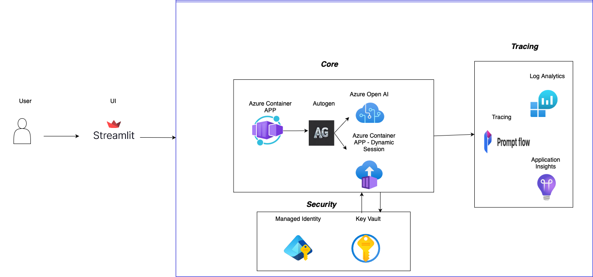
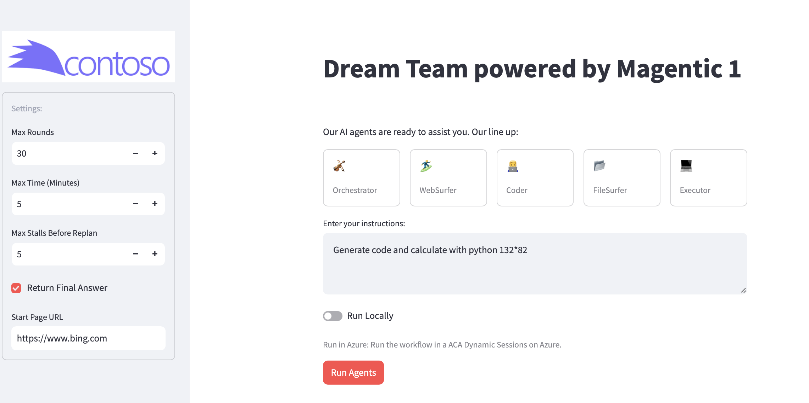

# Build A Dream Team with Autogen

This repository leverages Microsoft Autogen 0.4, Azure OpenAI and integration with Streamlit, to build an end-to-end multi-agent application, this repository makes it easy to build test and deploy an advanced multi-agent framework, based on [Magentic One](https://www.microsoft.com/en-us/research/articles/magentic-one-a-generalist-multi-agent-system-for-solving-complex-tasks/).

## Table of Contents

- [Key Features](#key-features)
- [Prerequisites](#prerequisites)
- [Getting Started](#getting-started)
  - [Clone the Repository](#clone-the-repository)
  - [Login to Azure](#login-to-azure)
  - [Deploy Azure Resources](#deploy-azure-resources)
- [Running Locally](#running-locally)
  - [Create a Virtual Environment](#create-a-virtual-environment)
  - [Install Dependencies](#install-dependencies)
  - [Update Configuration](#update-configuration)
  - [Start the Application](#start-the-application)



## Key Features <a id="key-features"></a>

The following are the key features:

- **Advanced Multi-agent Framework**: This solution is based on the popular framework [Autogen](https://github.com/microsoft/autogen) and [Magentic One](https://www.microsoft.com/en-us/research/articles/magentic-one-a-generalist-multi-agent-system-for-solving-complex-tasks/).
- **Friendly UI**: Easy way to build and share data apps powered by [Streamlit](https://streamlit.io/).
- **Easy Deployment**: Developer-friendly deployment that accelerates your path from a local development environment to Azure with [Azure Developer CLI](https://learn.microsoft.com/en-us/azure/developer/azure-developer-cli/overview?tabs=windows).
- **Secure Code Execution**: Fast access to secure sandboxed with strong isolation environments that are ideal for running code or applications with Azure Container Apps dynamic sessions.
- **Managed Identities**: Built-in Azure managed identities to eliminate the need for developers to manage these credentials.
- **Observability and Debugging**: Built-in features and tools for tracking, tracing, and debugging agent interactions and workflows, including [PromptFlow tracing](https://microsoft.github.io/promptflow/how-to-guides/tracing/index.html).

## Prerequisites <a id="prerequisites"></a>

- [Azure Subscription](https://azure.microsoft.com/en-us/pricing/purchase-options/azure-account?icid=azurefreeaccount).
- Azure Developer CLI: [Download azd for Windows](https://azdrelease.azureedge.net/azd/standalone/release/1.5.0/azd-windows-amd64.msi), [Other OS's](https://learn.microsoft.com/en-us/azure/developer/azure-developer-cli/install-azd).
- [Docker](https://docs.docker.com/get-started/get-docker/)
  - Once installed, run `docker login`.
- Python >= 3.10, < 3.13: [Download Python](https://www.python.org/downloads/release/python-3118/).
- (Optional) [uv](https://docs.astral.sh/uv/getting-started/installation/): Python package and project manager.

## Getting Started <a id="getting-started"></a>

### Clone the Repository <a id="clone-the-repository"></a>

```bash
git clone https://github.com/0Upjh80d/autogen-dream-team
```

### Login to Azure <a id="login-to-azure"></a>

```bash
azd auth login
```

> [!NOTE]
> You need to choose your preferred region (you can start with east us or sweden central or any other available region)

### Deploy Azure Resources <a id="deploy-azure-resources"></a>

```bash
azd up
```

## Running Locally

Change directory:

```bash
cd src
```

### Create a Virtual Environment <a id="create-a-virtual-environment"></a>

**uv (Recommended)**

```bash
uv venv
```

Once you have created a virtual environment, you may activate it.

On Unix or MacOS, run:

```bash
source .venv/bin/activate
```

On Windows, run:

```powershell
.venv\Scripts\activate
```

To deactivate the virtual environment, run:

```bash
deactivate
```

> [!TIP]
> More information about virtual environments can be found [here](https://docs.python.org/3/tutorial/venv.html).

### Install Dependencies

```bash
uv sync
playwright install --with-deps chromium
```

---

> [!NOTE]
> Alternatively, here are some of the most popular Python package and project managers, if you have opted to not use `uv`.
>
> **Poetry**
>
> ```bash
> # Create a virtual environment
> poetry shell
>
> # Install dependencies
> poetry install
> ```
>
> **Anaconda**
>
> ```bash
> # Create a virtual environment
> conda create -n venv python=3.12 -y
> conda activate venv
>
> # Install dependencies
> pip install -r requirements.txt
> ```

### Update Configuration <a id="update-configuration"></a>

If you used AZD to deploy the resources, simply run the code below:

```bash
azd env get-values > .env
```

Alternatively, copy [`.env.sample`](src/.env.sample) into `.env`.

> [!IMPORTANT]
> Magentic-One code uses code execution, you need to have Docker installed to run the examples if you use local execution.

### Start the Application <a id="start-the-application"></a>

```bash
streamlit run app.py
```

If your app is ready, you can (typically) browse http://localhost:8501 to see the app in action.



## Resources <a id="resources"></a>

- [Build your dream team with Autogen](https://techcommunity.microsoft.com/blog/Azure-AI-Services-blog/build-your-dream-team-with-autogen/4157961)
- [GenAI for SW developers: More Agents Is All You Need?](https://www.youtube.com/watch?v=wB9gD9FkgNA)
